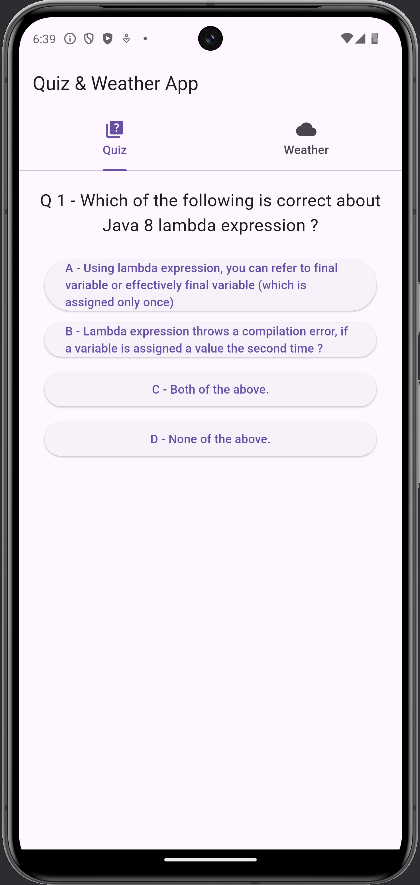
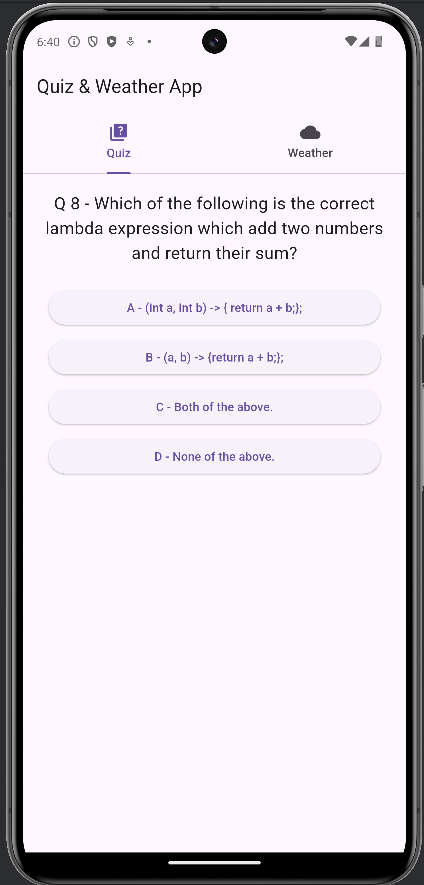
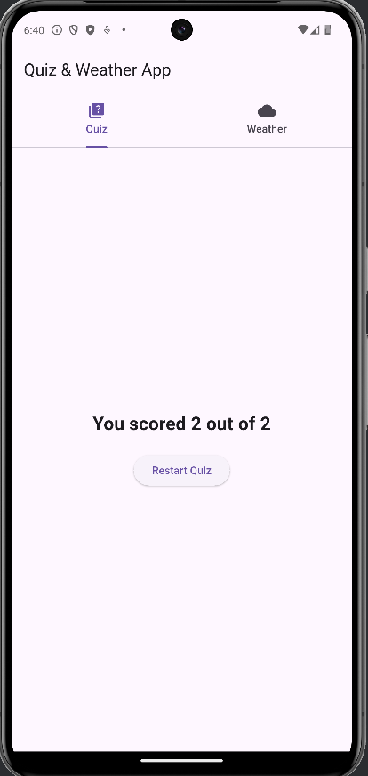
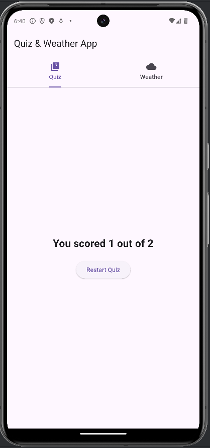
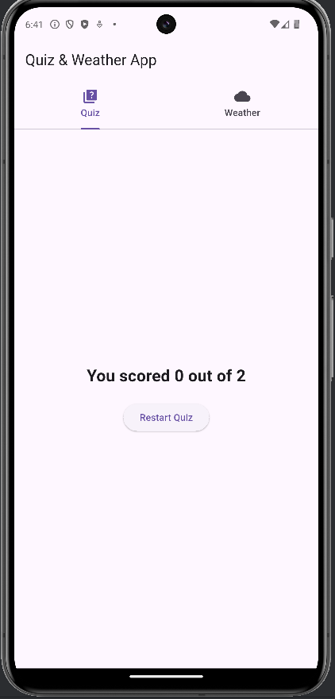
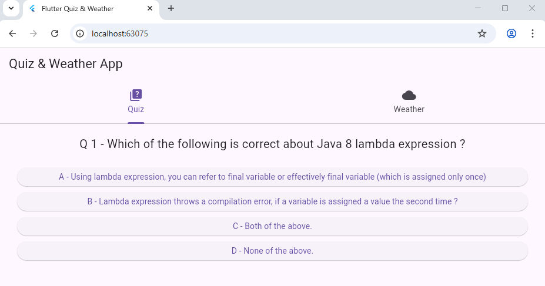
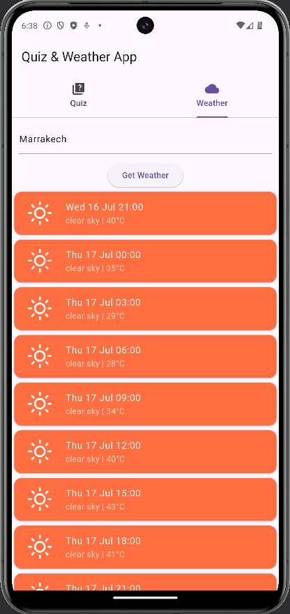
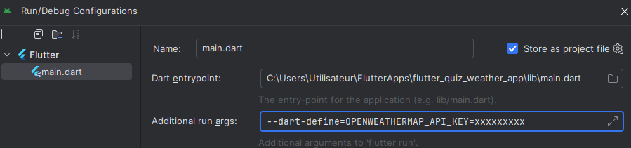

# Application Météo Flutter

Une application Flutter simple qui affiche un quiz et les prévisions météorologiques pour une ville donnée en utilisant l'API OpenWeatherMap.

## Table des matières
* [Fonctionnalités](#fonctionnalités)
* [Captures d'écran](#captures-décran)
* [Prérequis](#prérequis)
* [Installation](#installation)
    * [Configuration de la Clé API](#configuration-de-la-clé-api)
* [Comment utiliser](#comment-utiliser)
* [Structure du projet (simplifiée)](#structure-du-projet-simplifiée)
* [Auteur](#auteur)

## Fonctionnalités

*   Quiz : Application simple avec des questions et réponses.
*   Météo : Recherche de prévisions météorologiques par nom de ville.
*   Affichage des prévisions pour plusieurs jours/heures (selon l'API).
*   Gestion distincte des clés API pour les builds Web et mobiles/desktop.

## Captures d'écran

### Écran Quiz (version Mobile)

*Description : Question1 et choix de réponses*

*Description : Question2 et choix de réponses*

*Description : Score et recommencer*

### Écran Quiz (version Web)

*Description : Question1 et choix de réponses*

### Écran prévisions météo (version Mobile)

*Description : Météo d'une ville donnée*

### Écran prévisions météo (version Web)

*Description : Météo d'une ville donnée*

## Prérequis

*   Flutter SDK (version [VOTRE_VERSION_FLUTTER_SI_SPECIFIQUE, ex: 3.x.x] ou supérieure)
*   Dart SDK (inclus avec Flutter)
*   Un IDE comme Android Studio ou Visual Studio Code avec les plugins Flutter/Dart.
*   Une clé API valide de [OpenWeatherMap](https://openweathermap.org/api).

## Installation

1.  **Clonez le dépôt :**
2.  **Installez les dépendances Flutter :**
3.  **Configuration de la Clé API :**

    Cette application nécessite une clé API OpenWeatherMap pour fonctionner.

    *   **Pour les plateformes mobiles/desktop (Android, iOS, Desktop) :**
        1.  Créez un dossier `assets` à la racine de votre projet s'il n'existe pas.
        2.  À l'intérieur du dossier `assets`, créez un fichier nommé `.env`.
        3.  Ajoutez votre clé API dans ce fichier comme suit :    
        4.  **Exécutez l'application :**
            *   Sélectionnez un appareil (émulateur, appareil physique ou 'Chrome'/'Web Server' pour le web).
            *   Lancez l'application depuis votre IDE ou via la commande :
                (N'oubliez pas l'option `--dart-define` si vous exécutez pour le web comme indiqué ci-dessus).
                
                
## Comment utiliser

1.  Lancez l'application.
2.  Dans le champ de texte en haut, entrez le nom de la ville pour laquelle vous souhaitez obtenir les prévisions météorologiques.
3.  Appuyez sur la touche "Entrée" de votre clavier ou cliquez sur le bouton "Get Weather".
4.  Les prévisions s'afficheront sous forme de liste.

## Structure du projet (simplifiée)      
**Note sur `.env` et Git :** Si votre `.env` contient une clé API réelle et sensible, vous devriez l'ajouter à votre fichier `.gitignore` pour éviter de la commiter publiquement. Dans ce cas, fournissez un fichier `assets/.env.example` avec la structure attendue.

## Auteur

*   **[elghariaoui]**
    
